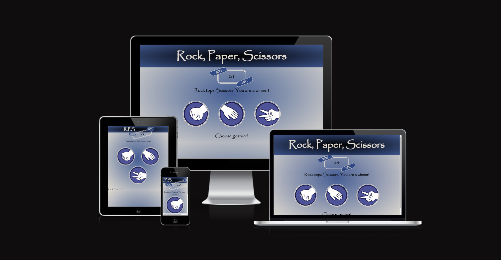
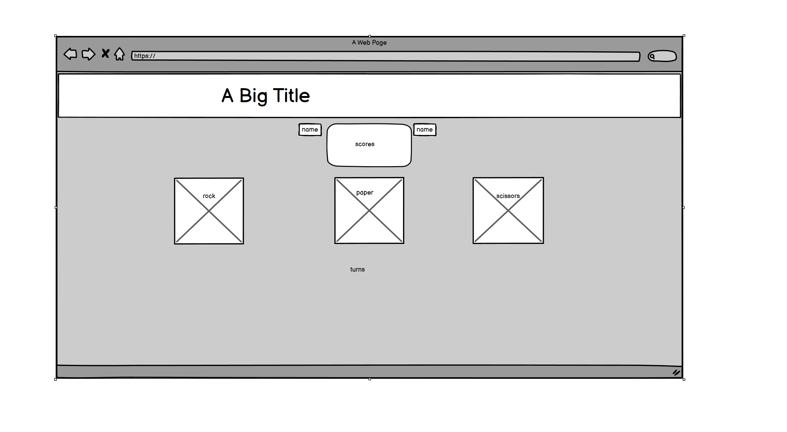
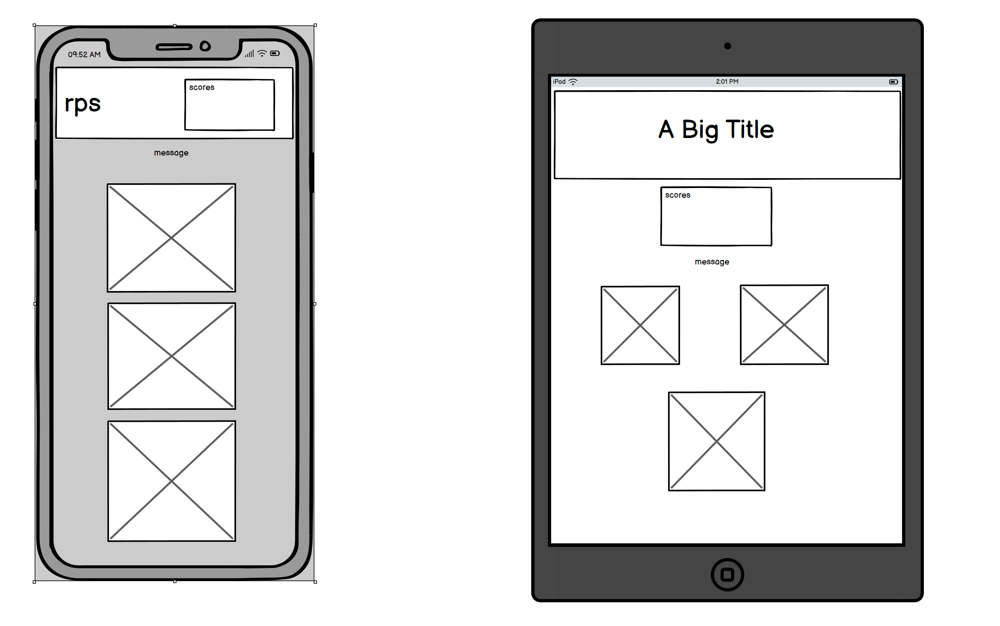
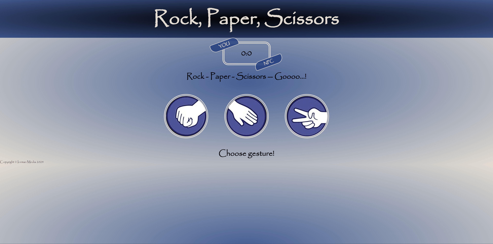
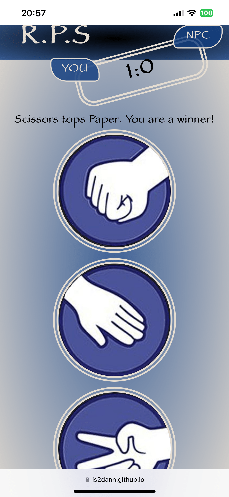
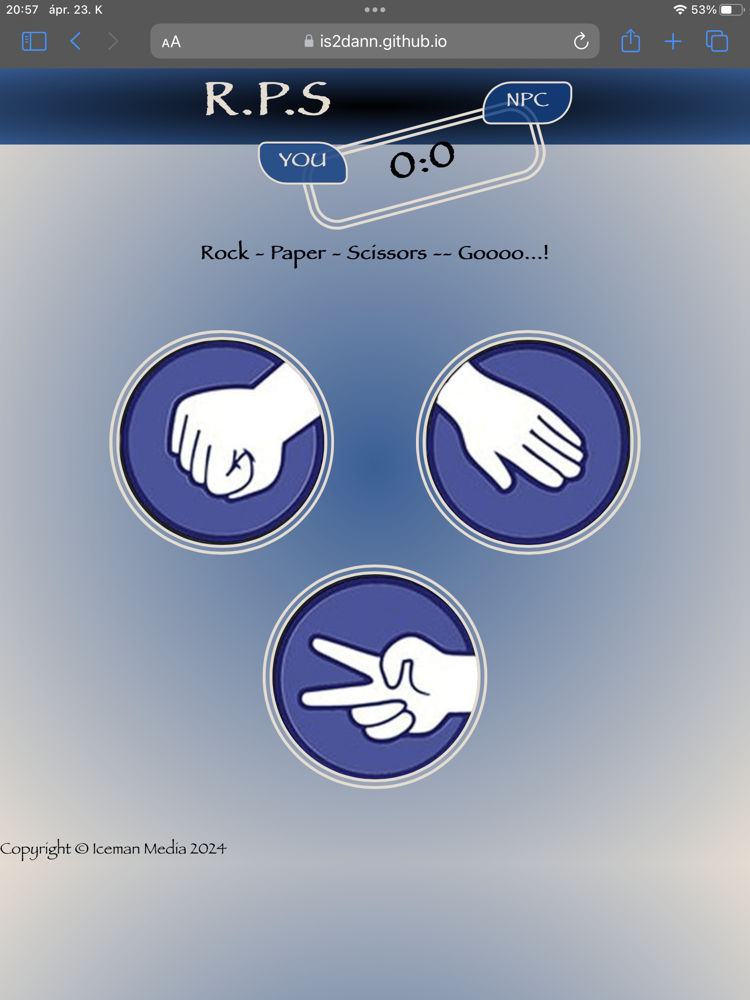

# Rock, Paper, Scissors game with some style

This is a stylish and fully responsive rock, paper, scissors game that you can play on every device we have nowadays.
With it's colourful design it's catches your eyes the first time you spot it. It is easily understandable, and with it's interactive handles, makes the game fun.

Try it yourself here: [RPS game](https://is2dann.github.io/RPS/)

## User stories
|Story No.|Story|
| ----------- | ----------- |
|1.| As a user,   I want to do a quick competitive game when I have a couple of minutes.    I know I did a good job, when somebody with the same idea, look up the web and finds my stylish rock, paper, scissors game and have a go with it. |
|2.| As a user,   Sometime I woul'd like to test my intuition.    I know I am done when I can test my intuition against a computer. |
|3.| As a user,   I would play with a game, that is colourful and stylish with interactive fun parts.    I know I did a good job, when my game has colours and style, with some moving parts and fun quotes or messages. |
|4.| As a user,   I would like to play with my game on different platforms.    I know I did a good job, when my game is responsive and can be played on multiple devices.|

***

## Wireframes
Below are the design that were used to start building the site.

| Desktop Landing page |
| ------- |
|  |

| Mobile and tablet Landing page |
| ------- |
|  |

***

## First view

| Landing page : Desktop |
| ------- |
|  |

| Landing page : Mobile |
| ------- |
|  |

| Landing page : Tablet |
| ------- |
|  |

***