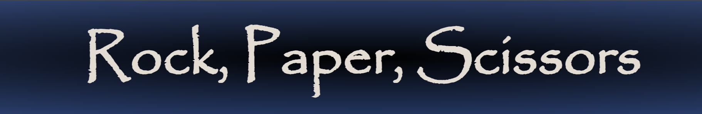

# Rock, Paper, Scissors game with some style

This is a stylish and fully responsive rock, paper, scissors game that you can play on every device we have nowadays.
With it's colourful design it's catches your eyes the first time you spot it. It is easily understandable, and with it's interactive handles, makes the game fun.

Try it yourself here: [RPS game](https://is2dann.github.io/RPS/)

## User stories
|Story No.|Story|
| ----------- | ----------- |
|1.| As a user,   I want to do a quick competitive game when I have a couple of minutes.    I know I did a good job, when somebody with the same idea, look up the web and finds my stylish rock, paper, scissors game and have a go with it. |
|2.| As a user,   Sometime I woul'd like to test my intuition.    I know I am done when I can test my intuition against a computer. |
|3.| As a user,   I would play with a game, that is colourful and stylish with interactive fun parts.    I know I did a good job, when my game has colours and style, with some moving parts and fun quotes or messages. |
|4.| As a user,   I would like to play with my game on different platforms.    I know I did a good job, when my game is responsive and can be played on multiple devices.|

***

## Wireframes
Below are the design that were used to start building the site.

| Desktop Landing page |
| ------- |
|  |

| Mobile and tablet Landing page |
| ------- |
|  |

***

## First view

| Landing page : Desktop |
| ------- |
|  |

| Landing page : Mobile |
| ------- |
|  |

| Landing page : Tablet |
| ------- |
|  |

***

## Features

-__Typography and Colour scheme__

As my main plan was to make this game stylish.  
I used Papyrus font as that is one of my favourite, because stylish but still readable and works on every platform.  
As the colours, my choice was blue as main colour and tan(#e4dcd1) and black added as a hue in the gradient background.
Also green, red, and purple indicators on winning, losing or draw scenarios.

### Existing features

-__Header__
* The game does have a header containing the name or title of the game.
    - Because the name is a tad long, I changed it to it's abbreviation on smaller screens with media queries in css.
    - Also, on smaller screens the scoreboard is tilted and flows in to the header area.

| Header |
| Desktop | Tablet/Phone |
| ------- | ------- |
|  |  |

-__Content__
* Straight away after opening the page, the scoreboard is visible below the header with 2 nametags, one for the gamer (YOU) and one for the computer (NPC - as non-playable-character)
    - The scoreboard tilts and crawls up a little bit into the header area on smaller screens.
    - Javascript been used to update the scores on win.
* Text below the scoreboard is initially set to the famous yell, when play this game in real life.
    - Javascript been used to change this text later automatically when there is a result of a game.
        - Win: e.g: Rock tops scissors. You are a winner! and a bright green glow appears around the text.
        - Lose: e.g: Scissors loses to Rock. You are a loser! and a bright red glow appears around the text.
        - Draw: e.g: Paper equals to Paper. It's a draw! and a bright purple glow appears around the text.

| Scoreboard & Message |
| ------- |
|  |

* Below this text 3 items can be found. 3 image of hands doing gestures of fist(rock), open palm(paper), two straight finger(scissors).  These are our playing buttons.
    - For interactivity style these buttons spin around and scale up when hover over with the cursor on a desktop or been tapped on a phone or tablet.
    - These icons are moving to 2 or 3 rows depends on the screen size.

| Icons or Buttons |
| Desktop | Tablet |
| ------- | ------- |
|  |  |

* Small text below the buttons are encourage us to "Choose a gesture" to start the game.
    - This text is not displaying on smaller screens.

-__Footer__
* There is no footer. A little section below the game on the left shows relevant data.

***

## Features left to implement

-__Future__
* The results message could be improved and extended with more relevant messages 
    - like: 
        - Scissors cuts paper. You are a winner.
        - Paper covers Rock.
* The whole game could be expanded to Rock, Paper, Scissors, Lizard, Spock game from the series Big Bang Theory. Or even further...
* Could make the game fully online so we could play with friends.